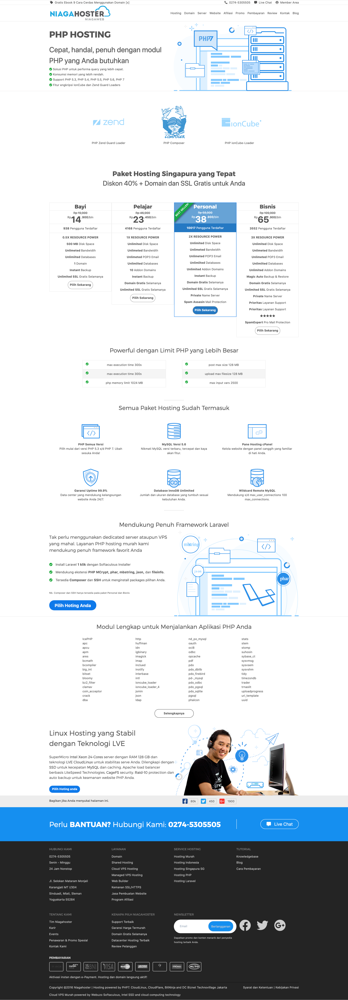

# **BoxBilling Installation Step-By-Step (Niagahoster)**

## **1. Preparation Guide**

- Download [BoxBiling](https://www.boxbilling.com/download)

- Move and extract BoxBilling inside this folder (_where `docker_compose.yml` is located_)

- Check if `bb-config.php` file exists inside **`BoxBilling`** folder
  - If not, create a file named `bb-config.php` inside **`BoxBilling`** folder

## **2. Installation Guide**

Run this command in your terminal:

_make sure your current directory is correct_

```bash
# Build images and start running containers.

$ docker-compose up --build
```

- ## __2.1 Front-End Landing Page__

  To see front-end landing page, go to: [localhost:8080](http:localhost:8080)

- ## __2.2 BoxBilling App__

  Go to: [localhost:8004/boxbilling/install/](http:localhost:8004/boxbilling/install/)

  - > ### 1. Preparation
  - Click next
  - > ### 2. Database
  - Set **Database hostname** to _`database`_ (this depends on how we express the service inside _docker-compose.yml_)
  - Set **Database name** to whatever you prefer
  - Set **Database user** & **Database password** accoding to what we provided inside `docker-compose.yml`, in this case:
    ```
    Database user: root
    Database password: root
    ```
  - > ### 3. Administrator

  - Set Administrator name, Email and Password accordingly

    _This will then be used as your login credentials as Admin_

---

## Here, `BoxBilling` installation has been completed.

<!-- But there are still some recommendations:
 - Remove installation module
 - Change configuration file permissions
 - Disable directory listing with .htaccess
 - Setup cron job
##To automate this process, execute `after-installation.sh` file provide this directory by running:
```
./after-installation.sh
``` -->
### Finally `Finish` and follow other instructions to register as client or login as Admin.

---

## **Front-End Landing Page**


